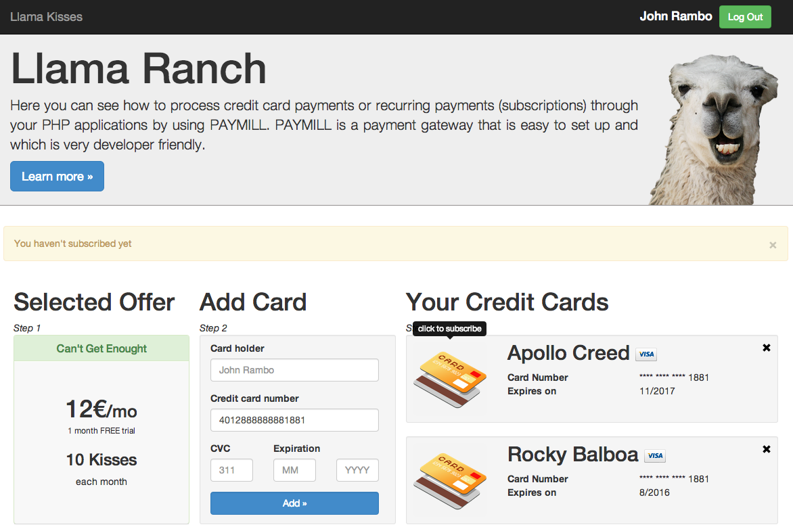

# Recurent Billing with PAYMILL

PAYMILL is a full-stack payment solution with very reasonable pricing and is easy to setup. See how to add it to a PHP application here.

If you ever need to process credit card payments or recurring payments aka. subscriptions through your PHP applications you should take a look at PAYMILL. PAYMILL is a payment gateway that is easy to set up and which is very developer friendly. It only charges fees on a per-transaction basis and these are very reasonable. There are no monthly fees or other hidden costs.

### What does the application

In this tutorial we’ll use PAYMILL to add recurring payments to a PHP application. The application we’ll use is a site that sells Llama Kisses. ;) The customer can subscribe to plan and each month he will be chanrged by PAYMILL to get his llama kisses.

There are four different plans and users can sign up for any one of them to create a subscription. When the user licks on one of the **Sign Up** buttons, he will be redirected to the sign up page.

After the user register himself he will be asked to provide one or more credit cards.

Now when the user have at least one credit card he can select one of them by pressing the credit card icon

Or remove existing credit card if this credit card is not currently used by the subscription.

Ofcource the user can change his credit card

